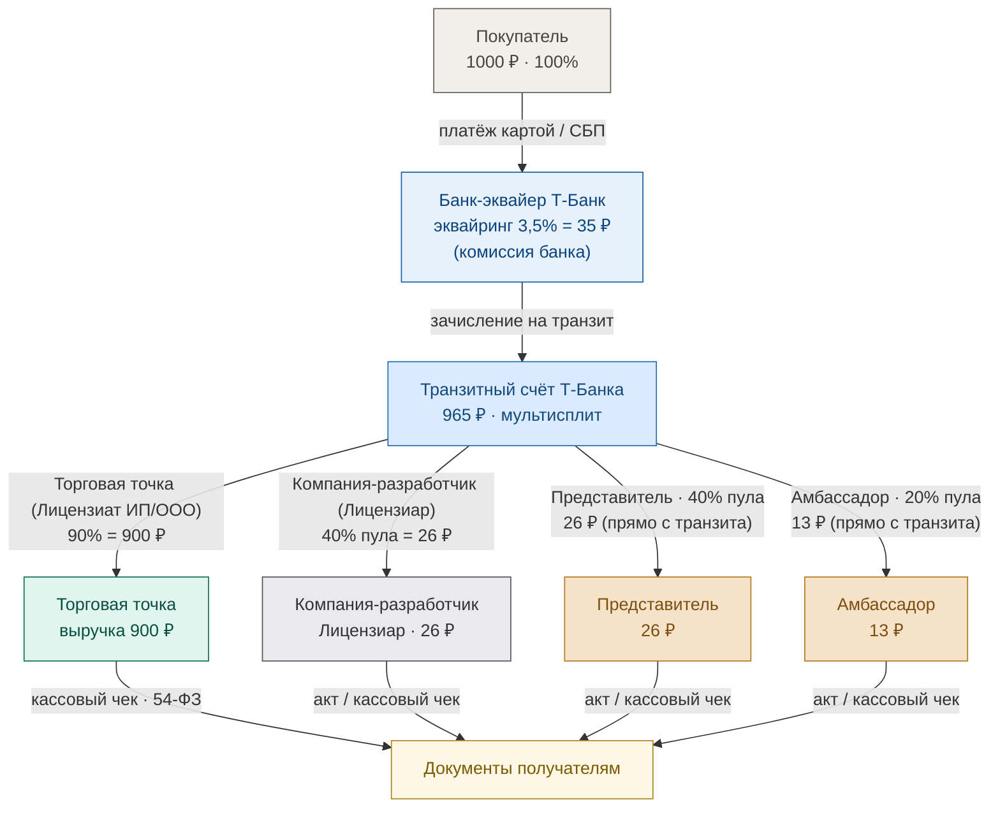
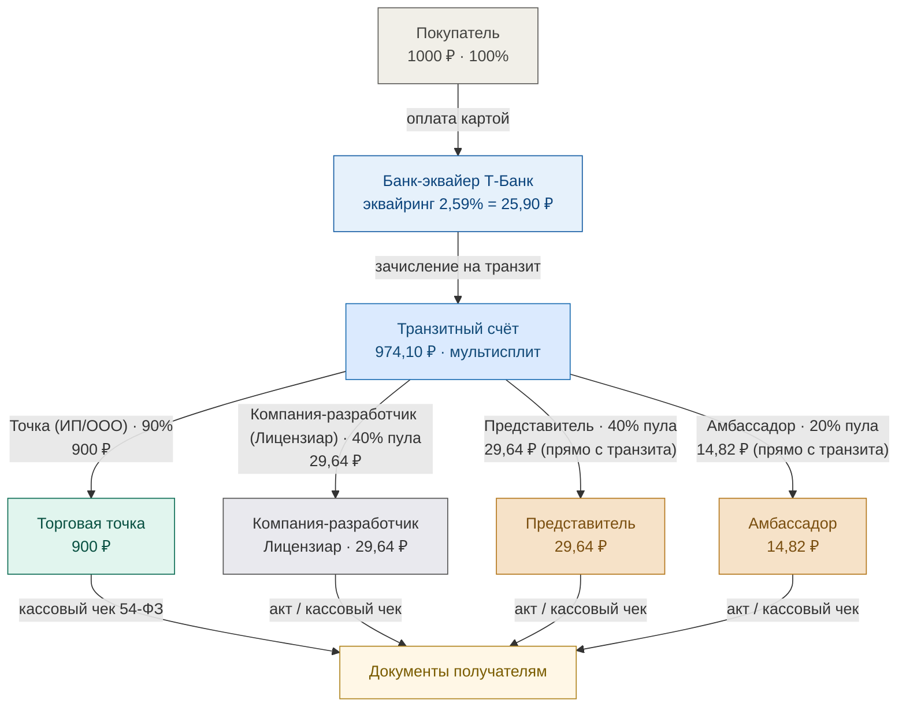
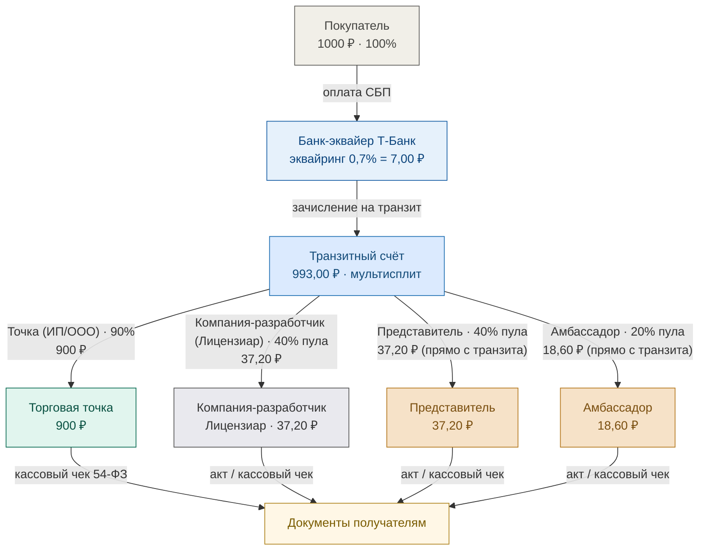

# Схема движения средств LOVII — Лицензиар: Компания-разработчик

> Альтернативная схема на примере заказа **1000 ₽** (параллельно базовой схеме из `money_flow_lovii.md`):
> роль **Лицензиара выполняет Компания-разработчик** (а не LOVII), а выплаты
> **Представителю и Амбассадору идут напрямую с транзитного счёта**, минуя счёт лицензиара.
> Ниже — базовая (плановая) ставка и все варианты по тарифам банка Т-Банк
> (Карта 2,59% / СБП 0,7% / T-Pay 2,59%). Нагрузка на МСП = 10% (точка получает 900 ₽).

## Базовая схема (плановая ставка эквайринга 3,5%)



## Варианты по тарифам банка на приём средств

Условие: **нагрузка на МСП всегда 10%** (точка получает 900 ₽). Доля пула =
**10% − эквайринг**, делится 40/40/20 (Лицензиар / Представитель / Амбассадор).
Три тарифа Т-Банка (Приложение № 3 к договору № МР-08.26/АКС_01):

| Тариф эквайринга | Эквайринг | Пул (10% − экв.) | Банк, ₽ | Пул, ₽ | Лицензиар (40%) | Представитель (40%) | Амбассадор (20%) |
|---|---|---|---|---|---|---|---|
| Карта 2,59% | 2,59% | 7,41% | 25,90 | 74,10 | 29,64 | 29,64 | 14,82 |
| СБП 0,7% | 0,7% | 9,3% | 7,00 | 93,00 | 37,20 | 37,20 | 18,60 |
| T-Pay 2,59% | 2,59% | 7,41% | 25,90 | 74,10 | 29,64 | 29,64 | 14,82 |

### Схема А — Карта (эквайринг 2,59%)



### Схема Б — СБП (эквайринг 0,7%)



### Схема В — T-Pay (эквайринг 2,59%)


## Чем отличается от базовой схемы (`money_flow_lovii.md`)

- **Лицензиар — Компания-разработчик**, а не LOVII. Транзитный счёт Т-Банка делает
  мультисплит сразу на **4 получателя**: Торговая точка, Компания-разработчик,
  Представитель, Амбассадор.
- **Представитель и Амбассадор получают выплаты напрямую с транзитного счёта**,
  а не со счёта лицензиара (как в базовой схеме, где LOVII сначала собирал пул,
  а затем делил его на доли).
- Доля пула (10% − эквайринг) делится 40/40/20:
  **Лицензиар · Представитель · Амбассадор** (см. таблицу выше для каждого тарифа).
- Отдельной выплаты роялти **Разработчику ПО нет**: роль лицензиара и разработчика
  совмещена в одной компании, поэтому вся доля лицензиара остаётся у Компания-разработчик.
  Чистая маржа лицензиара = 40% пула (например, 29,64 ₽ по карте / 37,20 ₽ по СБП).
- Баланс транзита: 900 (точка) + пул = 1000 − эквайринг (сходится для каждого тарифа).

## Пояснения

- **Банк-эквайер** удерживает комиссию по тарифу (Карта 2,59% = 25,90 ₽ / СБП 0,7% = 7 ₽
  / T-Pay 2,59% = 25,90 ₽) + перечисление 0,5% на вывод получателю (договор Т-Банк
  № МР-08.26/АКС_01). Точка в реальности получает чуть больше 900 ₽ из-за меньшей комиссии.
- **Транзитный счёт Т-Банка** — на него поступает полная сумма, банк выполняет мультисплит
  на всех получателей по одной заявке.
- **Торговая точка (Лицензиат ИП/ООО)** получает **90% = 900 ₽** выручки.
- **Документы**: кассовый чек 54-ФЗ (выбивает точка, «Предоплата 100%») и акт/чек
  по каждой выплате представителю и амбассадору; квитанция об оплате — от лицензиара.
- В доход **Компании-разработчика (Лицензиара)** попадает только комиссия платформы
  (40% пула), а не вся сумма заказа.

> При необходимости добавлю вариант с арендодателем или другим распределением долей —
> скажите.

<!-- Mermaid для GitHub Pages: Jekyll/kramdown не рендерит диаграммы сам,
поэтому подключаем mermaid.js и вручную превращаем блоки ```mermaid в <div class="mermaid">.
На github.com этот <script> вырезается санитайзером (там Mermaid рисует нативно). -->
<script src="https://cdn.jsdelivr.net/npm/mermaid@11/dist/mermaid.min.js"></script>
<script>
  document.querySelectorAll('pre code.language-mermaid').forEach(function (el) {
    var div = document.createElement('div');
    div.className = 'mermaid';
    div.textContent = el.textContent;
    el.parentNode.replaceWith(div);
  });
  mermaid.initialize({ startOnLoad: false, theme: 'default', securityLevel: 'loose', htmlLabels: true });
  mermaid.run();
</script>
