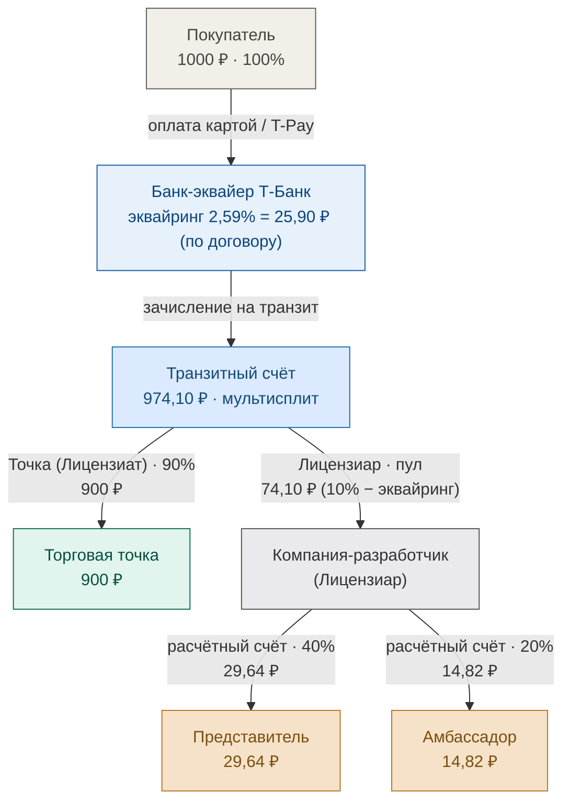
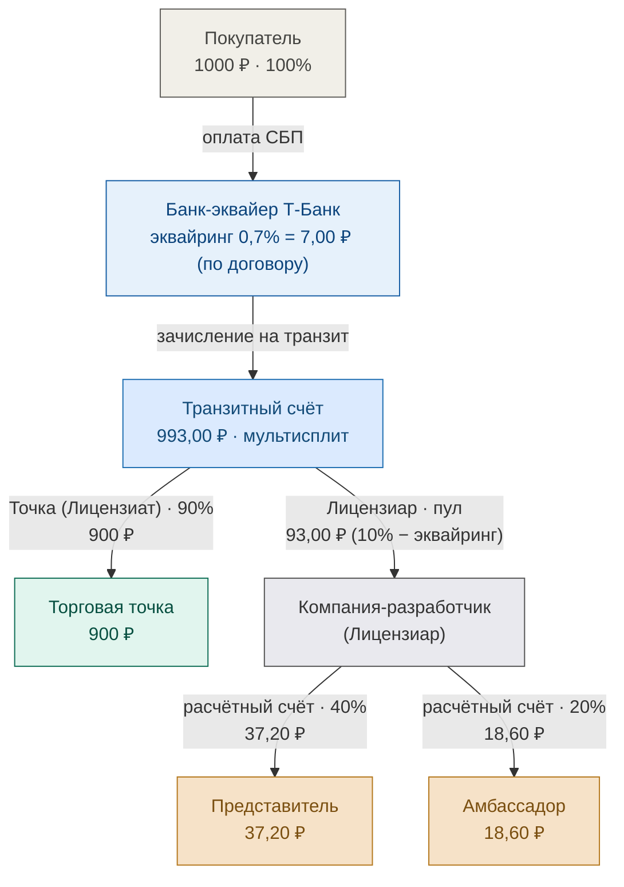
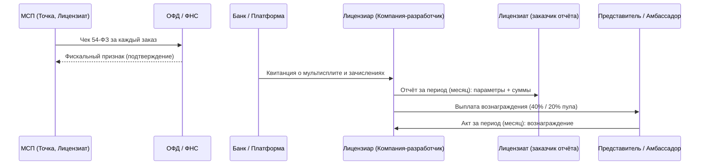

# Движение средств и документооборот LOVII

Единый публичный документ платформы LOVII: согласованная схема движения средств
**и** полный документооборот (кассовый чек 54-ФЗ, квитанция, отчёт, акты закрывающие период).

**Источник тарифов на приём средств** — Договор Т-Банк № МР-08.26/АКС_01,
Приложение № 3: эквайринг **Карта 2,59%** (мин 3,49 ₽), **СБП 0,7%**, **T-Pay 2,59%** (мин 3,49 ₽).
Вывод средств получателям по договору: перечисление третьему лицу (п. 3.4) **0,5%**,
перевод «Получателю» **1% мин 30 ₽**.

> Нагрузка МСП (10%, точка получает 90%) и распределение пула **40 / 40 / 20**
> (Лицензиар / Представитель / Амбассадор) — **коммерческие параметры платформы**,
> задаются в соглашении с партнёром, а не являются ставками договора банка.
> Показаны как значения по умолчанию на примере заказа 1000 ₽.

---

## 1. Движение средств

Роль **Лицензиара выполняет Компания-разработчик**. Транзитный счёт Т-Банка делает
мультисплит на **2 получателя**: Торговая точка (Лицензиат, 90%) и Компания-разработчик
(пул комиссии). Пул целиком поступает на расчётный счёт Лицензиара, который далее
сам перечисляет выплаты Представителю (40% пула) и Амбассадору (20% пула),
а **40% оставляет себе** (маржа). Отдельной выплаты роялти Разработчику ПО нет —
роль лицензиара и разработчика совмещена в одной компании.

### 1.1 Карта и T-Pay (эквайринг 2,59%)

### 1.2 СБП (эквайринг 0,7%)

### 1.3 Расклад сумм (пример заказа 1000 ₽, нагрузка МСП 10%)

| Получатель | Карта / T-Pay (2,59%) | СБП (0,7%) |
|---|---|---|
| Банк-эквайер (комиссия) | 25,90 ₽ | 7,00 ₽ |
| Транзитный остаток | 974,10 ₽ | 993,00 ₽ |
| Торговая точка (Лицензиат, 90%) | 900,00 ₽ | 900,00 ₽ |
| **Пул комиссии (Лицензиар)** | **74,10 ₽** | **93,00 ₽** |
| → Лицензиар удерживает (40%) | 29,64 ₽ | 37,20 ₽ |
| → Представитель (40%) | 29,64 ₽ | 37,20 ₽ |
| → Амбассадор (20%) | 14,82 ₽ | 18,60 ₽ |

При выводе средств получателям применяются комиссии договора (0,5% перечисление
третьему лицу / 1% мин 30 ₽ перевод «Получателю») — точные значения уточняются
при настройке выплат.

---

## 2. Документооборот

### 2.1 Кассовый чек ОФД (за каждый заказ)
Торговая точка (МСП, Лицензиат) пробивает чек по 54-ФЗ **на каждый заказ**:
поток ККТ → ОФД → ФНС. Чек привязан к заказу (номер, сумма, способ оплаты).

### 2.2 Квитанция (подтверждение движения средств)
Банк / платформа формирует квитанцию о проведении мультисплита и зачислениях
на транзитный счёт — подтверждение корректного распределения платежа.

### 2.3 Отчёт Лицензиара Лицензиату (за период)
Лицензиар готовит отчёт для Лицензиата со **всеми параметрами и цифрами за период**
(**месяц по умолчанию**): заказы, комиссии, распределение пула.
Аналог пакета сверки (Accounting / Payout report).

### 2.4 Акты Представителей и Амбассадоров (за период)
Представители и Амбассадоры готовят акт за период (**месяц по умолчанию**) на
основании отчёта Лицензиара — документ, закрывающий период по вознаграждению.

---

